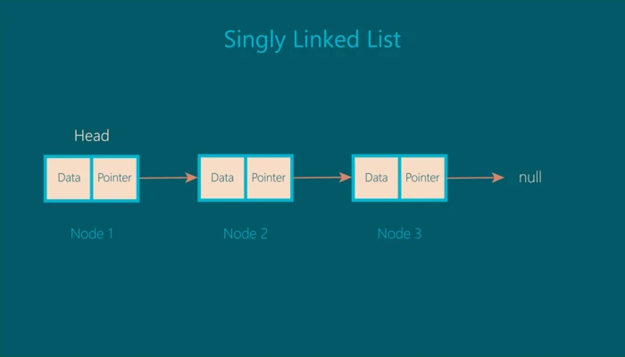

## 链表

> 链表格是一种线性数据结构，类似于数组，但不像数组的元素存储在特定的存储器位置或索引中，链表格的每个元素都是一个独立的对象，其中包含一个指针或链接指向列表中的下一个对象。

**链表由具有两个属性的节点组成：数据和指针。**  
节点内的指针指向列表中的下一个节点。 链表中的第一个节点称为 head。 为了更好地理解，让我们看一下描述链表图示：
  
每个节点都有两个属性，data 和 pointer。 指针指向列表中的下一个节点，最后一个节点的指针指向 null，上图是一个单链表

在 JavaScript 中，链表长这样：

```js
const list = {
  head: {
    value: 6,
    next: {
      value: 10,
      next: {
        value: 12,
        next: {
          value: 3,
          next: null,
        },
      },
    },
  },
}
```

### 链表的优点

可以很容易地从链表中删除或添加节点，而无需重组整个数据结构。这是它相对于数组的一个优势。

### 链表的类型

- 单向链表：每个节点只包含一个指向下一个节点的指针。也就是我们到上面一直在讨论的。
- 双向链表：每个节点包含两个指针，一个指向下一个节点，另一个指向前一个节点。
- 循形链表：循环链表是链表的一种变体，它的最后一个节点指向第一个节点或它之前的任何其他节点，从而形成一个循环。

```js
// 实现一个表节点
class ListNode {
  constructor(data) {
    this.data = data
    this.next = null
  }
}
// 实现一个链表
class LinkedList {
  constructor(head = null) {
    this.head = head
  }
  // 该方法返回链表中存在的节点数：
  size() {
    let count = 0
    let node = this.head
    while (node) {
      count++
      node = node.next
    }
    return count
  }
  // 该方法清空链表：
  clear() {
    this.head = null
  }
  // 该方法返回链表的最后一个节点：
  getLast() {
    let lastNode = this.head
    if (lastNode) {
      while (lastNode.next) {
        lastNode = lastNode.next
      }
    }
    return lastNode
  }
  // 该方法返回链表第一个节点：
  getFirst() {
    return this.head
  }
}
// 创建两个表节点，node1 和 node2，以及他们之间的指针：
let node1 = new ListNode(2)
let node2 = new ListNode(5)
node1.next = node2
// node1 创建一个链表：
let list = new LinkedList(node1)
console.log(list.head.next.data) //returns 5
```
